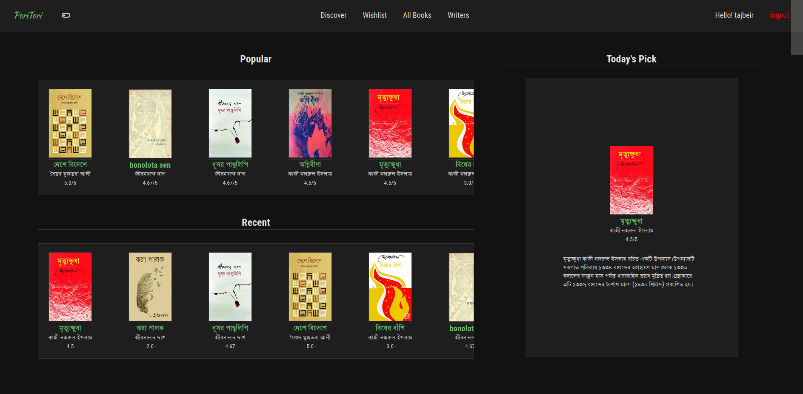
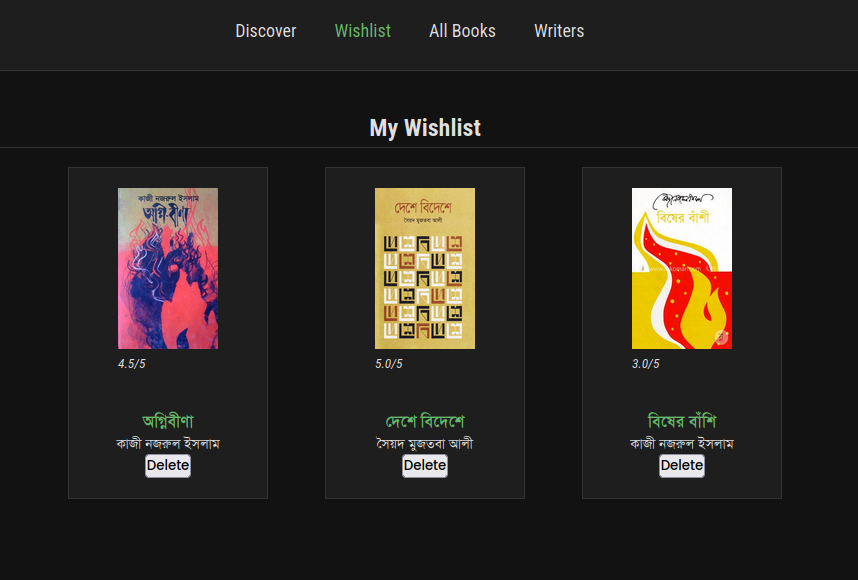
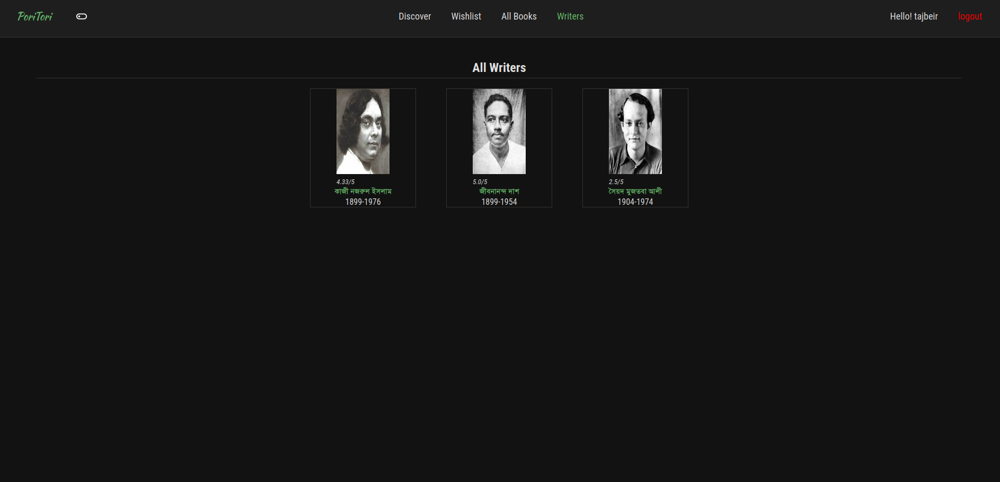
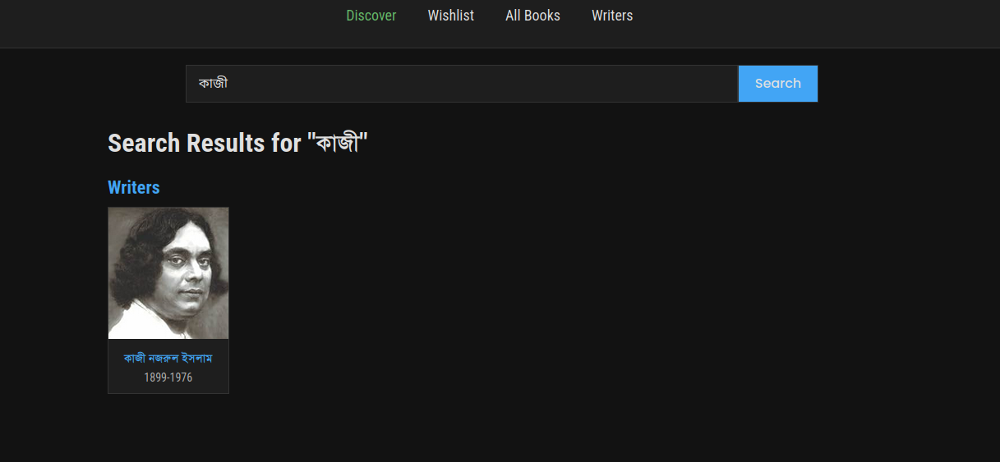

# 📚 MyBookReview

A Django-based web app that lets users explore, review, and rate books.  
Users can add books to their wishlist, leave reviews, and browse featured titles — all in a clean light/dark theme.

---

## 🌟 Features

- 🌓 Light/Dark theme toggle  
- 💬 User reviews and comments  
- ⭐ Star rating system  
- 📚 Wishlist functionality  
- 👤 Author profiles  
- 🔍 Search and filter books  
- 📅 Recently added & popular books section  

---

## 🖼️ Screenshots

### 🏠 Homepage


### 📖 Book Details


### Wishlist 


### Writers


### Discover


---

## ⚙️ Installation

### 1️⃣ Clone the repository
```bash
git clone https://github.com/<yourusername>/mybookreview.git
cd mybookreview
